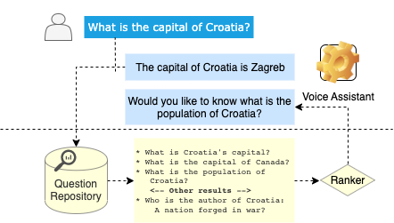

## Follow-up Query Bank (FQ-Bank)

The Follow-up Query (FQ) Bank has been released as part of the paper **Learning to Retrieve Engaging Follow-Up Queries** accepted at <a href="https://2023.eacl.org/" target="_blank">EACL 2023</a>.

## Abstract
Open domain conversational agents can answer a broad range of targeted  queries. However, the sequential nature of interaction with these systems makes knowledge exploration a lengthy task which burdens the user with asking a chain of well phrased questions. In this paper, we present a retrieval based system and associated  dataset for predicting the next questions that the user might have. Such a system can proactively assist users in knowledge exploration leading to a more engaging dialog. The retrieval system is trained on a dataset which   contains ~14K multi-turn information-seeking conversations with a valid follow-up question and a set of invalid candidates. The invalid candidates are generated to simulate various  syntactic and semantic confounders such as paraphrases, partial entity match, irrelevant entity, and ASR errors.
We use confounder specific techniques to simulate these negative examples on the OR-QuAC dataset and develop a dataset called the Follow-up Query Bank (FQ-Bank). 
Then, we train ranking models on FQ-Bank and present results comparing supervised and unsupervised approaches.
The results suggest that we can retrieve the valid follow-ups by ranking them in higher positions compared to confounders, but further knowledge grounding can improve ranking performance.




## Data Format
The train, dev, and test sets are provided in three JSON files. Each JSON file contains a list. Each item in the list contains the following keys:

* **id** : A dictionary having two keys `dialogue` and `turn`.
* **current_utterance** : The current utterance
* **current_response** : Response to the current utterance
* **dialog_history** : A list of turns before the current utterance
* **candidate_utterances** : Two lists with the keys `valid` and `invalid` contains the valid and invalid follow-up queries. Each of the invalid utterances is accompanied by the the reason explaining why the utterance is not a valid follow-up.


## Citation
```bibtex
@inproceedings{richardson-etal-2023-fqbank,
    title = "Learning to Retrieve Engaging Follow-Up Queries",
    author = "Richardson, Christopher and Kar, Sudipta and Kumar, Anjishnu and Ramachandran, Anand and Zia Khan, Omar and Raeesy, Zeynab and Sethy, Abhinav",
    booktitle = "Proceedings of the 17th Conference of the European Chapter of the Association for Computational Linguistics",
    year = "2023"
}
```

## Security

See [CONTRIBUTING](CONTRIBUTING.md#security-issue-notifications) for more information.

## License Summary

The documentation is made available under the Creative Commons Attribution-ShareAlike 4.0 International License. See the LICENSE file.

The sample code within this documentation is made available under the MIT-0 license. See the LICENSE-SAMPLECODE file.
